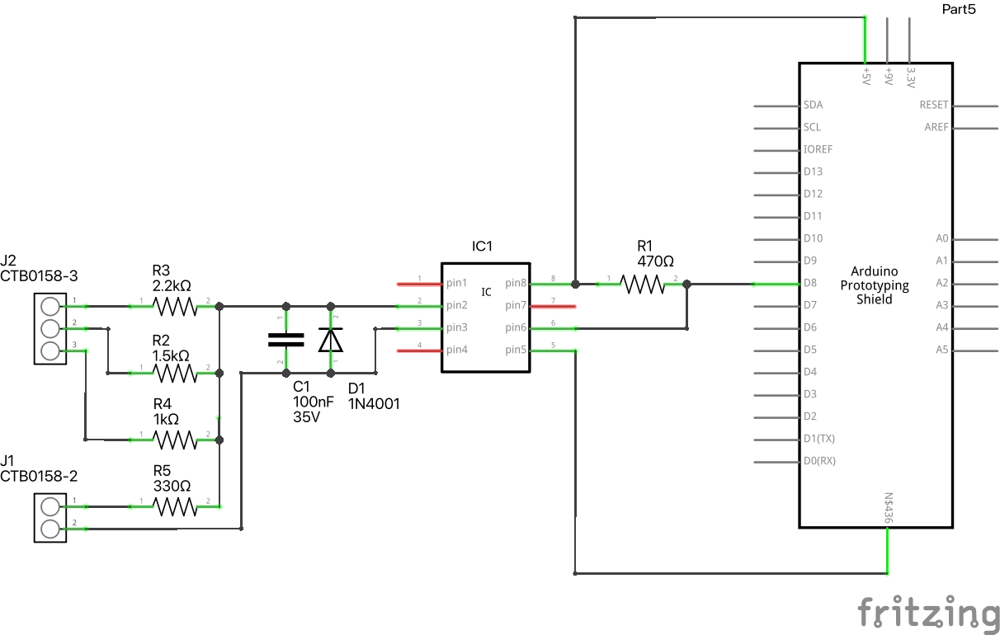
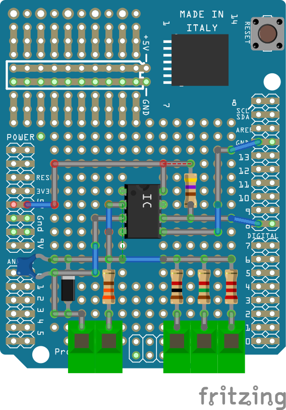

# DCCInspector-EX

Giver mulighed for at "lytte" til DCC beskeder sendt ud på skinnerne fra Control Center.

Mere om DCCInspection-EX findes på [https://dcc-ex.com/ex-dccinspector](https://dcc-ex.com/ex-dccinspector).

Folderen Datasheets indeholder specifikationer for optokobleren (6n137) og dioden (1n4148).

## Arduino Proto Shield for DCC

Folderen Fritzing indeholder diagram for elektronikken, som før det muligt at forbinde Arduino med DCC som føres i skinnerne.

Det er muligt at forbinde til 4 forskellige DCC spændingsniveauer. VIGTIGT! Hvis man forbinder forkert (for lille modstand til for stor DCC spænding) risikerer man at brænde optokobleren af.

Den færdige implementation af designet på et Arduino proto shield kan se således ud:

## Installation af program på Arduino

Folderen Libraries indeholder de Arduino biblioteker, som skal installeres lokalt i Arduino IDE inden DCCInspector-EX kan kompileres. Det nemmeste er at gøre det indefra Arduino IDE ved at vælge Tools -> Manage libraries. I så fald benytter man ikke de biblioteker, som ligger i Libraries folderen men download'er de nyeste versioner via Internettet.

Herefter skal man åbne DCCInspector-EX.ino, som ligger i folderen DCCInspector-EX. Man forbinder Arduino'en til computeren, vælger den indefra Arduino IDE hvorefter man kompilerer koden og upload'er den til Arduino'en.

## Brug af DCCInspection-EX

Forbind Arduino'en med computeren samt DCC skinnerne. Åben Arduino IDE og vælge Tools -> Serial Monitor. Der vil nu komme komme et vindue på skærmen hvor der som minimum vil blive vist en status hvert 4 sekund.
